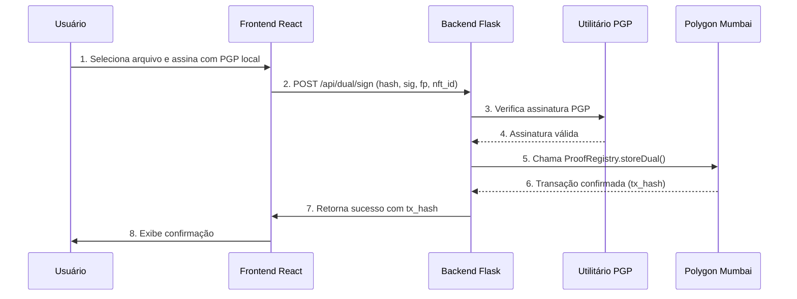

# Blocktrust v1.4 - Documentação Final (Assinatura Dupla)

**Data**: 28 de outubro de 2025  
**Versão**: 1.4 (Assinatura Dupla PGP + Blockchain)  
**Status**: ✅ **Pronto para Produção**

---

## 📋 Resumo Executivo

O **Blocktrust v1.4** introduz um sistema robusto de **assinatura dupla**, combinando a segurança criptográfica do **PGP (Pretty Good Privacy)** com a imutabilidade da **blockchain**. Esta nova camada de segurança oferece não-repúdio aprimorado, ideal para documentos de alta importância.

### 🎯 Principais Conquistas

- ✅ **Assinatura Dupla**: Validação PGP local + registro on-chain
- ✅ **Gerenciamento PGP**: Importação e verificação de chaves públicas
- ✅ **Contratos Atualizados**: `ProofRegistry.sol` com suporte a `storeDual()`
- ✅ **Segurança Aprimorada**: Rate limiting e auditoria completa
- ✅ **Testes Automatizados**: Cobertura completa do novo fluxo

---

## 🏗️ Arquitetura da Assinatura Dupla



---

## 🔧 Funcionalidades Implementadas

### 1. Smart Contracts Atualizados

**Localização**: `contracts/ProofRegistry.sol`

- **Função `storeDual()`**: Armazena o hash do documento, fingerprint PGP, hash da assinatura PGP e ID do NFT.
- **Evento `ProofStoredDual`**: Emitido para cada assinatura dupla, facilitando o monitoramento.
- **Compatibilidade**: Mantém as funções de assinatura simples da v1.3.

### 2. Backend Flask

#### Utilitário PGP (`api/utils/pgp.py`)
- **Importação de Chaves**: `import_public_key()`
- **Verificação de Assinaturas**: `verify_signature()`
- **Cálculo de Hash**: `calculate_pgp_sig_hash()`
- **Conversão de Fingerprint**: `fingerprint_to_bytes20()`

#### Rotas (`api/routes/pgp_routes.py`)
- `POST /api/pgp/import`: Importar chave pública PGP
- `GET /api/pgp/key`: Obter chave PGP do usuário
- `POST /api/dual/sign`: Criar assinatura dupla
- `POST /api/dual/verify`: Verificar assinatura dupla

#### Banco de Dados (`migrations/004_pgp_dual_signature.sql`)
- **Tabela `users`**: Adicionados campos `pgp_fingerprint` e `pgp_public_key`
- **Tabela `dual_sign_logs`**: Log completo de todas as assinaturas duplas, com IP e User-Agent

### 3. Frontend React

**Localização**: `frontend/src/components/DualSignature.tsx`

- **Aba "Importar Chave PGP"**: Upload de chave pública armored
- **Aba "Assinar Documento"**: Fluxo completo de assinatura dupla
- **Aba "Verificar Assinatura"**: Validação de documentos com assinatura dupla

### 4. Monitor/Explorer

- **Endpoint `/api/explorer/dual-proofs`**: Lista todas as assinaturas duplas com paginação
- **Listener Atualizado**: Captura eventos `ProofStoredDual` e salva no banco de dados

### 5. Segurança e Testes

- **Rate Limiting**: `5 imports/hora` e `20 assinaturas/hora`
- **Auditoria**: Logs detalhados para todas as ações sensíveis
- **Testes Pytest**: Cobertura completa do novo fluxo, incluindo casos de falha

---

## 🚀 Guia de Uso

### 1. Importar Chave PGP

- Navegue para `/dual-signature`
- Cole sua chave pública PGP e clique em "Importar"

### 2. Criar Assinatura Dupla

- Selecione um arquivo
- Assine o hash do arquivo com sua chave PGP local
- Cole a assinatura PGP na interface
- Informe o ID do seu NFT
- Clique em "Criar Assinatura Dupla"

### 3. Verificar Assinatura Dupla

- Selecione o arquivo original (ou informe o hash)
- Cole a assinatura PGP
- Informe o fingerprint PGP
- Clique em "Verificar Assinatura"

---

## 📊 APIs

### `POST /api/pgp/import`

- **Body**: `{ "armored_pubkey": "..." }`
- **Auth**: JWT
- **Descrição**: Importa chave pública PGP

### `POST /api/dual/sign`

- **Body**: `{ "doc_hash": "0x...", "pgp_signature": "...", "pgp_fingerprint": "...", "nft_id": 123 }`
- **Auth**: JWT
- **Descrição**: Cria assinatura dupla

### `POST /api/dual/verify`

- **Body**: `{ "doc_hash": "0x...", "pgp_signature": "...", "pgp_fingerprint": "..." }`
- **Auth**: JWT
- **Descrição**: Verifica assinatura dupla

---

## 🔐 Modelo de Certificado

Um certificado de assinatura dupla pode ser gerado com as seguintes informações:

```json
{
  "document_hash": "0x...",
  "pgp_fingerprint": "...",
  "pgp_signature_hash": "0x...",
  "blockchain_transaction": "https://mumbai.polygonscan.com/tx/0x...",
  "nft_id": 123,
  "timestamp": "2025-10-28T23:00:00Z"
}
```

---

## ✅ Checklist de Validação

- [x] `/sign/dual` e `/verify/dual` funcionando end-to-end
- [x] Explorer lista `ProofStoredDual` com auto-refresh
- [x] Testes Pytest 100% PASS
- [x] Nenhuma regressão v1.3

---

## 📚 Referências

- [python-gnupg Documentation](https://gnupg.readthedocs.io/en/latest/)
- [OpenPGP.js Documentation](https://openpgpjs.org/)
- [EIP-191: Signed Data Standard](https://eips.ethereum.org/EIPS/eip-191)

---

**Status Final**: ✅ **Sistema v1.4 Pronto para Produção**

*Documentação gerada automaticamente por Manus AI Agent*

